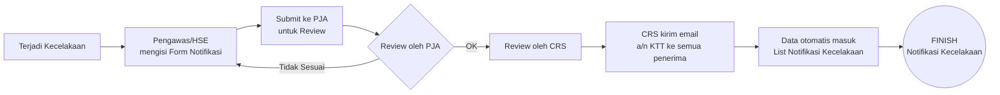
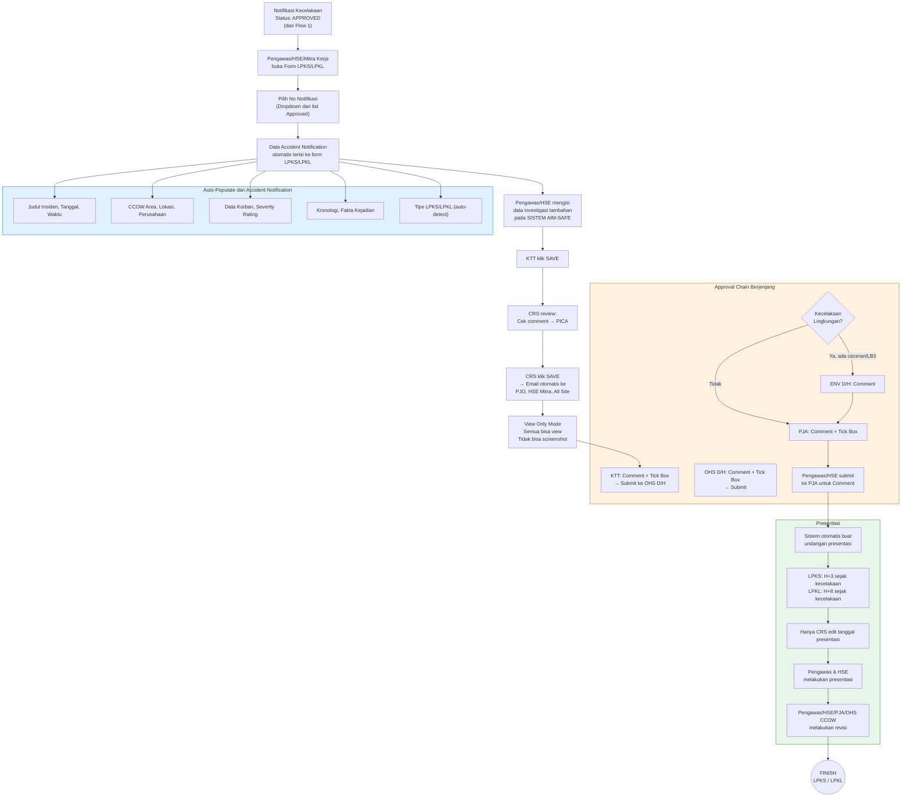
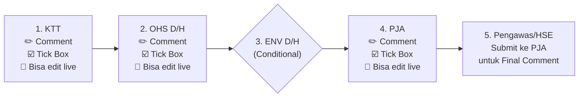

# 📋 PRD — SISTEM AIM-SAFE: Safety Management System

> **Document ID**: PRD-SAFETY-001 Rev 1.0  
> **Tanggal**: 18 Mei 2026  
> **Status**: Draft — Menunggu Review  
> **Project**: `safetyv1` (Laravel + Inertia.js + React + Ant Design)

---

## 1. Executive Summary

Sistem AIM-SAFE adalah platform manajemen keselamatan kerja digital yang mengelola seluruh siklus hidup insiden/kecelakaan, mulai dari **Notifikasi Kecelakaan** awal hingga **Laporan Penyelidikan Kecelakaan (LPKS/LPKL)** dengan alur approval berjenjang.

Berdasarkan flowchart, sistem memiliki **2 flow utama**:

| Flow | Nama | Status Implementasi |
|------|------|---------------------|
| **Flow 1** | Notifikasi Kecelakaan | ✅ **Sudah Selesai** (Approved + No. Notifikasi terbuat) |
| **Flow 2** | LPKS / LPKL | ❌ **Belum Diimplementasi** |

---

## 2. Flow 1: Notifikasi Kecelakaan (✅ SELESAI)

### 2.1 Flowchart Summary



### 2.2 Analisa Implementasi Saat Ini

> [!NOTE]
> Semua fitur inti Flow 1 sudah terimplementasi dengan baik di codebase.

#### ✅ Fitur yang Sudah Ada

| # | Fitur | File/Komponen | Status |
|---|-------|---------------|--------|
| 1 | Form Notifikasi (Create/Edit) | `AccidentNotificationModal.jsx` | ✅ |
| 2 | Auto-generate No. Notifikasi & No. Investigasi | `AccidentNotification.php` (Model booted) | ✅ |
| 3 | Upload foto (maks 4 file, jpg/png) | `MediaSection.jsx` + API Controller | ✅ |
| 4 | Severity Rating (Aktual & Potensial, 5 kriteria) | `SeveritySection.jsx` | ✅ |
| 5 | Data Korban lengkap | `VictimSection.jsx` | ✅ |
| 6 | Kronologi & Fakta Kejadian | `ChronologySection.jsx` | ✅ |
| 7 | Save as Draft / Submit | `useAccidentNotification.jsx` | ✅ |
| 8 | Approval oleh PJA (Approve/Return) | `handleApprove` / `handleReturn` | ✅ |
| 9 | Public Approval via Email Link | `PublicApprovalController.php` | ✅ |
| 10 | Export PDF | `exportPdf()` + Blade template | ✅ |
| 11 | Send Email Notification (after Approved) | `SendNotificationModal.jsx` | ✅ |
| 12 | Email Distribution Groups (DB-driven) | `EmailGroupController` + `email_groups` table | ✅ |
| 13 | Auto LPKS/LPKL Type Detection | `AccidentNotificationModal.jsx` (useEffect severity) | ✅ |
| 14 | RBAC (Role-based Access Control) | Permission-based (`canCreate`, `canApprove`, etc.) | ✅ |
| 15 | Filter data by Company (non-CRS) | API Controller `index()` | ✅ |

#### Status Flow Mapping

| Status ID | Nama | Keterangan |
|-----------|------|------------|
| 3 | Open | Baru dibuat / menunggu review |
| 6 | Submitted | Dikirim untuk approval PJA |
| 7 | **Approved** | Disetujui PJA ✅ |
| 8 | Return | Dikembalikan untuk perbaikan |

#### Format Nomor yang Sudah Terbuat

```
No. Investigasi (IR): {seq}/IR-{CCOW}/{bulan_romawi}/{tahun}
No. Notifikasi (NI):  {seq}/NI-{CCOW}/{bulan_romawi}/{tahun}
```

Contoh: `01/IR-LC/V/2026` dan `01/NI-LC/V/2026`

---

## 3. Flow 2: LPKS / LPKL (❌ BELUM DIIMPLEMENTASI)

### 3.1 Flowchart Summary



### 3.2 Detail Requirements

#### 3.2.1 Form LPKS / LPKL

| # | Requirement | Detail |
|---|-------------|--------|
| 1 | Akses dari List | Bisa diakses dari **List Notifikasi Kecelakaan** ATAU **List Daftar Kecelakaan** |
| 2 | **Pilih No Notifikasi** | **Dropdown berisi daftar No. Notifikasi yang sudah APPROVED** → otomatis mengisi data dari Accident Notification ke form LPKS/LPKL |
| 3 | Tipe Laporan | LPKS (nilai Aktual rendah) atau LPKL (nilai Aktual/Potensial tinggi) — **sudah auto-detect dari severity** |
| 4 | Upload Dokumen | Maks **10 dokumen** (jpg, PDF, PPT, Word, Excel) |
| 5 | Relasi | Linked ke `accident_notifications` (one-to-one) via `notification_number` |
| 6 | Editable | Pengawas/HSE mengisi secara **LIVE** pada sistem |
| 7 | Auto Save Draft | Data simpan otomatis Safe Draft bila mati jaringan / klik Safe Draft bila belum lengkap |

#### 3.2.1a Auto-Populate Data dari Accident Notification

> [!IMPORTANT]
> Ketika user memilih **No Notifikasi** pada form LPKS/LPKL, data berikut dari `accident_notifications` akan **otomatis terisi** ke form inputan LPKS/LPKL (read-only / non-editable):

| # | Field yang Auto-Populate | Sumber (Accident Notification) | Editable di LPKS/LPKL? |
|---|--------------------------|-------------------------------|------------------------|
| 1 | Judul Insiden | `incident_title` | ❌ Read-only |
| 2 | Tanggal Insiden | `incident_date` | ❌ Read-only |
| 3 | Waktu Insiden | `incident_time` | ❌ Read-only |
| 4 | CCOW Area | `ccow_id` → nama CCOW | ❌ Read-only |
| 5 | Lokasi / Pit Area | `location_id` → nama lokasi | ❌ Read-only |
| 6 | Lokasi Detail | `location_detail` | ❌ Read-only |
| 7 | Perusahaan | `company_id` → nama perusahaan | ❌ Read-only |
| 8 | Departemen | `department_id` → nama dept | ❌ Read-only |
| 9 | Unit | `unit` | ❌ Read-only |
| 10 | Tipe Insiden / Klasifikasi | `incident_type_id` → kategori | ❌ Read-only |
| 11 | Data Korban | `victim_*` fields | ❌ Read-only |
| 12 | Severity Aktual (K3, KK, LH, KSL, PP) | `actual_k3`, `actual_kk`, dll | ❌ Read-only |
| 13 | Severity Potensial (K3, KK, LH, KSL, PP) | `potential_k3`, `potential_kk`, dll | ❌ Read-only |
| 14 | Tipe LPKS/LPKL | Auto-detect dari severity | ❌ Read-only |
| 15 | Kronologi Awal | `initial_chronology` | ❌ Read-only |
| 16 | Fakta Kejadian | `incident_facts` (JSON) | ❌ Read-only |
| 17 | Tindakan Perbaikan Awal | `corrective_actions` (JSON) | ❌ Read-only |
| 18 | HPRI | `is_hpri` | ❌ Read-only |
| 19 | No. Investigasi (IR) | `accident_number` | ❌ Read-only |
| 20 | No. Notifikasi (NI) | `notification_number` | ❌ Read-only |
| 21 | Pelaporan KaIT | `kait_reporting_date` | ❌ Read-only |
| 22 | Photos/Media | `photos` (relasi) | ❌ Read-only (tampil sebagai preview) |

**Field tambahan khusus LPKS/LPKL** (diisi manual oleh Pengawas/HSE):

| # | Field Baru | Keterangan | Editable? |
|---|-----------|------------|----------|
| 1 | Hasil Investigasi Detail | Narasi lengkap penyelidikan | ✅ Ya |
| 2 | Root Cause Analysis | Analisa akar masalah | ✅ Ya |
| 3 | Corrective Action Plan (PICA) | Rencana tindakan perbaikan detail | ✅ Ya |
| 4 | Preventive Action | Tindakan pencegahan | ✅ Ya |
| 5 | Dokumen Pendukung (10 file) | jpg, PDF, PPT, Word, Excel | ✅ Ya |
| 6 | Catatan/Komentar per Level | Comment box per approval level | ✅ Ya (per role) |

#### 3.2.2 Approval Chain (Berjenjang)



> [!IMPORTANT]
> **ENV D/H hanya wajib** jika kecelakaan merupakan **Kecelakaan Lingkungan** (terdapat ceceran/LB3). PJA yang menentukan dan mengajukan ke ENV D/H.

**Detail per Role:**

| Step | Role | Aksi Wajib | Bisa Edit Live | Submit Ke |
|------|------|------------|----------------|-----------|
| 1 | KTT | Comment + Tick Box | ✅ Ya | OHS D/H |
| 2 | OHS D/H | Comment + Tick Box | ✅ Ya | ENV D/H / PJA |
| 3 | ENV D/H | Comment saja | ✅ Ya | PJA |
| 4 | PJA | Comment + Tick Box | ✅ Ya | Selesai |
| 5 | Pengawas/HSE | Final submit | - | PJA (Comment) |

#### 3.2.3 Notifikasi Email (Setelah CRS SAVE)

| Target | Metode |
|--------|--------|
| PJO | Email otomatis |
| HSE Mitra | Email otomatis |
| All Site Users AMI | Email otomatis |
| CRS bisa Call Back Kecelakaan bila diperlukan | Manual action |

> [!WARNING]
> Setelah CRS klik SAVE: **Semua hanya bisa View** dan **tidak bisa screenshot** (view-only mode).

#### 3.2.4 PICA Integration

- KTT klik SAVE → CRS dapat melihat apakah ada comment yang bisa menjadi **PICA**
- CRS bisa menambahkan item ke PICA dari comments

#### 3.2.5 Presentasi

| Parameter | LPKS | LPKL |
|-----------|------|------|
| **Deadline Presentasi** | H+3 sejak kecelakaan | H+8 sejak kecelakaan |
| **Yang edit tanggal** | Hanya CRS | Hanya CRS |
| **Pelaksana** | Pengawas & HSE | Pengawas & HSE |
| **Revisi Pasca Presentasi** | Pengawas/HSE/PJA/OHS CCOW | Pengawas/HSE/PJA/OHS CCOW |

### 3.3 Role-Based Access (Berdasarkan Gambar 1)

> [!NOTE]
> Setiap role memiliki akses yang berbeda terhadap modul Notifikasi Kecelakaan, LPKS, dan LPKL. **CRS dapat memberikan akses input kepada nama-nama tertentu.**

| Role | Input Notifikasi | Input LPKS | Input LPKL | View LPKS | View LPKL | Edit & Comment | Upload PICA | Screenshot |
|------|:----------------:|:----------:|:----------:|:---------:|:---------:|:--------------:|:-----------:|:----------:|
| **Mitra Kerja** (Admin, Pengawas, HSE, PJO) | ✅ | ✅ | ✅ | ❌ | ❌ | ❌ | ✅ | ❌ |
| **CCOW** (Semua email CCOW — all site users) | View only | View only | View only | ✅ | ✅ | ❌ | ✅ | ❌ |
| **PJA, ENV D/H, OHS D/H, KTT** | ✅ Edit | ✅ Edit & Comment | ✅ Edit & Comment | ✅ | ✅ | ✅ | ✅ | ❌ |
| **Dept OHS & Dept ENV** | ✅ Edit | ✅ Edit | ✅ Edit | ✅ | ✅ | ✅ | ✅ | ✅ |
| **CRS** | ✅ Semua | ✅ Semua | ✅ Semua | ✅ | ✅ | ✅ | ✅ | ✅ |

**Catatan Penting:**
- **CRS** dapat memberikan akses khusus kepada nama-nama tertentu untuk input notifikasi kecelakaan, LPKS, dan LPKL
- **CRS** bisa Call Back LPKS/LPKL bila diperlukan untuk membuka kembali
- **CRS** kirim link hasil LPKS dan LPKL kepada semua user, termasuk PJO dan HSE Mitra Kerja dari Perusahaan yang terjadi kecelakaan
- Bila kecelakaan di CCOW, PJO dan HSE tidak perlu dikirimkan. Bila perlu dikirimkan link closing, dapat ditambahkan alamat email saat CRS klik SAVE
- **OHS dan ENC** bisa screenshot semua yang ada di SISTEM AIM-SAFE
- **Mitra Kerja, CCOW, PJA/KTT** → batasan: tidak bisa screenshot semua yang ada di SISTEM AIM-SAFE
- **Kebutuhan Analisis** akan otomatis masuk ke dalam grafik. Bila diperlukan bisa dilakukan download Excel

---

## 4. Gap Analysis: Flowchart vs Codebase

### 4.1 Fitur yang Perlu Dibangun (Flow 2)

| # | Fitur | Priority | Kompleksitas |
|---|-------|----------|-------------|
| 1 | **Module LPKS/LPKL** — Page, Form, dan API | 🔴 Critical | High |
| 2 | **Multi-level Approval Chain** (KTT → OHS → ENV → PJA) | 🔴 Critical | High |
| 3 | **Approval Comments & Tick Box per Level** | 🔴 Critical | Medium |
| 4 | **Role-based Edit Live** (setiap level bisa edit saat review) | 🟡 High | Medium |
| 5 | **Upload 10 dokumen** (multi-type: jpg, PDF, PPT, Word, Excel) | 🟡 High | Medium |
| 6 | **Auto-generate Undangan Presentasi** | 🟡 High | Medium |
| 7 | **Jadwal Presentasi** (H+3 LPKS, H+8 LPKL) | 🟡 High | Low |
| 8 | **CRS-only Edit Tanggal Presentasi** | 🟢 Medium | Low |
| 9 | **PICA Integration** (CRS convert comment → PICA) | 🟡 High | High |
| 10 | **View Only + Anti-Screenshot Mode** | 🟢 Medium | Medium |
| 11 | **Callback Kecelakaan** (CRS action) | 🟢 Medium | Low |
| 12 | **Revisi Pasca Presentasi** (multi-role) | 🟡 High | Medium |
| 13 | **List Daftar Kecelakaan** (separate view) | 🟢 Medium | Low |

### 4.2 Perubahan Database yang Diperlukan

#### Tabel Baru

```
investigation_reports        → Data LPKS/LPKL
investigation_documents      → Upload dokumen (10 file)
investigation_approvals      → Log approval per level
investigation_comments       → Comments per level approval
pica_items                   → Problem Identification & Corrective Action
presentations                → Jadwal & data presentasi
presentation_revisions       → Revisi pasca presentasi
```

#### Perubahan Tabel Existing

```
accident_notifications       → Tambah: investigation_status, has_lpks_lpkl (boolean)
m_statuses                   → Tambah status baru untuk multi-level approval
```

---

## 5. Skema Database Baru (Proposed)

### 5.1 `investigation_reports`

| Column | Type | Description |
|--------|------|-------------|
| id | bigint PK | Auto increment |
| accident_notification_id | FK → accident_notifications | Relasi 1-to-1 |
| report_type | enum('LPKS','LPKL') | Auto-detect dari severity |
| report_number | string | Auto-generate |
| investigation_status | string | Current approval level |
| current_approval_level | enum | KTT/OHS_DH/ENV_DH/PJA/COMPLETED |
| is_environmental | boolean | Ada ceceran/LB3? |
| content | longtext/JSON | Isi laporan penyelidikan |
| safe_draft | boolean | Auto-save flag |
| ktt_approved | boolean | Tick box KTT |
| ohs_approved | boolean | Tick box OHS D/H |
| env_approved | boolean | Tick box ENV D/H (nullable) |
| pja_approved | boolean | Tick box PJA |
| created_by | string | |
| updated_by | string | |
| timestamps | | |

### 5.2 `investigation_approvals`

| Column | Type | Description |
|--------|------|-------------|
| id | bigint PK | |
| investigation_report_id | FK | |
| approval_level | enum | KTT/OHS_DH/ENV_DH/PJA |
| approved_by | FK → users | |
| comment | text | Wajib per level |
| tick_box | boolean | Checkbox approval |
| approved_at | timestamp | |

### 5.3 `presentations`

| Column | Type | Description |
|--------|------|-------------|
| id | bigint PK | |
| investigation_report_id | FK | |
| scheduled_date | date | Auto: H+3 (LPKS) / H+8 (LPKL) |
| actual_date | date | CRS bisa edit |
| status | enum | Scheduled/Completed/Revised |
| edited_by | FK → users | Hanya CRS |

---

## 6. Implementation Plan (Phased)

### Phase 1: Foundation (Week 1-2)
- [ ] Buat migration tabel baru (`investigation_reports`, `investigation_documents`, `investigation_approvals`)
- [ ] Buat Model + Relationships
- [ ] Buat API Controller LPKS/LPKL (CRUD)
- [ ] Tambah routes baru
- [ ] Tambah role/permission baru (KTT, OHS D/H, ENV D/H)

### Phase 2: Frontend LPKS/LPKL (Week 3-4)
- [ ] Buat page `InvestigationReport/Index.jsx`
- [ ] Buat form modal (multi-section, mirip AccidentNotificationModal)
- [ ] Multi-file upload (10 files, multi-type)
- [ ] Approval chain UI (step indicator + comment form per level)
- [ ] Integrasi ke List Notifikasi Kecelakaan (tombol "Buat LPKS/LPKL")

### Phase 3: Approval Chain & Presentasi (Week 5-6)
- [ ] Multi-level approval backend logic
- [ ] Email notification per level
- [ ] Auto-generate undangan presentasi
- [ ] CRS edit tanggal presentasi
- [ ] View-only mode after CRS save
- [ ] Revisi pasca presentasi

### Phase 4: PICA & Polish (Week 7-8)
- [ ] PICA module (CRS convert comments)
- [ ] Anti-screenshot mode (CSS/JS protection)
- [ ] Callback kecelakaan feature
- [ ] Dashboard statistics update
- [ ] Testing & QA

---

## 7. Arsitektur Teknis

### 7.1 Stack yang Dipakai (Existing)

| Layer | Teknologi |
|-------|-----------|
| Backend | Laravel 11 (PHP) |
| Frontend | React + Inertia.js |
| UI Library | Ant Design v5 |
| State | TanStack Table + React Hooks |
| API | RESTful (Token-based auth) |
| PDF | DomPDF (Barryvdh) |
| Email | Laravel Mail + SMTP |
| Database | MySQL |
| Storage | Laravel Storage (public disk) |

### 7.2 Folder Structure (Proposed)

```
resources/js/Pages/
├── AccidentNotification/         ← Flow 1 (✅ Done)
│   ├── Index.jsx
│   ├── Hooks/
│   └── Partials/
│
├── InvestigationReport/          ← Flow 2 (🆕 New)
│   ├── Index.jsx
│   ├── Hooks/
│   │   └── useInvestigationReport.jsx
│   └── Partials/
│       ├── InvestigationReportModal.jsx
│       ├── ApprovalChainSection.jsx
│       ├── DocumentUploadSection.jsx
│       ├── PresentationSection.jsx
│       └── Components/
│           ├── ApprovalStepIndicator.jsx
│           ├── CommentBox.jsx
│           └── PicaIntegration.jsx
│
└── Pica/                         ← PICA Module (🆕 New)
    ├── Index.jsx
    └── Partials/
```

### 7.3 API Endpoints (Proposed)

```
# Investigation Reports (LPKS/LPKL)
GET    /api/investigation-report              → List
POST   /api/investigation-report              → Create
GET    /api/investigation-report/{id}         → Detail
PUT    /api/investigation-report/{id}         → Update
DELETE /api/investigation-report/{id}         → Delete

# Approval Chain
POST   /api/investigation-report/{id}/approve → Approve per level
POST   /api/investigation-report/{id}/return  → Return per level

# Documents
POST   /api/investigation-report/{id}/documents → Upload
DELETE /api/investigation-report/{id}/documents/{docId} → Delete

# Presentation
GET    /api/investigation-report/{id}/presentation → Detail
PUT    /api/investigation-report/{id}/presentation → Update (CRS only)

# PICA
GET    /api/pica                              → List
POST   /api/pica                              → Create from comment
PUT    /api/pica/{id}                         → Update
```

---

## 8. Kesimpulan & Rekomendasi

### ✅ Apa yang Sudah Berhasil (Flow 1)

Flow 1 **Notifikasi Kecelakaan** sudah **100% terimplementasi** dengan fitur:
- Form lengkap dengan semua section (Incident Overview, Severity, Victim, Chronology, Media, Reporter/Approver)
- Auto-generate nomor (IR & NI) 
- Approval workflow (Submit → PJA Review → Approve/Return)
- Public approval via email link (UUID-based)
- Email notification blast (with PDF attachment)
- Email distribution groups (DB-driven + Quick Add)
- RBAC & data filtering per company
- PDF export

### 🔴 Apa yang Perlu Dikerjakan (Flow 2)

Flow 2 **LPKS/LPKL** adalah modul terpisah baru yang membutuhkan:

1. **Database schema baru** — 5-7 tabel baru
2. **Multi-level approval chain** — Logic yang lebih kompleks dari Flow 1
3. **Presentasi scheduling** — Auto-calculate H+3/H+8
4. **PICA integration** — Modul baru
5. **View-only enforcement** — Post-CRS save

> [!TIP]
> **Rekomendasi**: Mulai dari **Phase 1 (Database + API)** agar fondasi kokoh, lalu bangun UI di Phase 2. Gunakan pattern yang sama dengan AccidentNotification untuk konsistensi kode.

---

*Document generated: 18 Mei 2026 | Author: AI Assistant | Awaiting Review*
